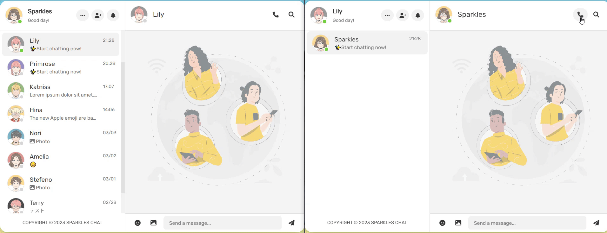
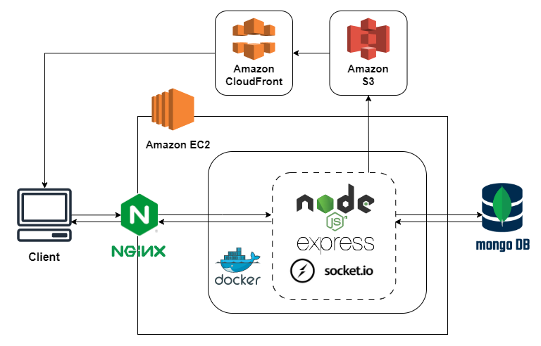

# Sparkles Chat

  

✨Sparkles Chat provides real-time voice and text communication, allowing you to chat with friends anytime and anywhere.

🔗 Website URL: https://sparklezz.site/

📃 API Documentation: https://app.swaggerhub.com/apis-docs/shaoyunjian/sparkleschat/1.0.0

👤 Test Account and Password:
|  | Account | Password |
| --- | --- | --- |
| ① | sparkles@sparkles.com | 12345678 |
| ② | hina@sparkles.com | 12345678 |

## Table of Contents

- [Main Features](#main-features)
  - [Real-time Text Chat with Socket.IO](#real-time-text-chat-with-socketio)
  - [Real-time Voice Chat with PeerJS](#real-time-voice-chat-with-peerjs)
  - [Image Sharing](#image-sharing)
- [Other Features](#other-features)
  - [User Search](#user-search)
  - [Friend Request](#friend-request)
  - [Avatar Edit](#avatar-edit)
  - [Member System](#member-system)
- [Backend Technique](#backend-technique)
  - [Language/Web Framework](#language--web-framework)
  - [Database](#database)
  - [Cloud Services (AWS)](#cloud-services-aws)
  - [Networking](#networking)
  - [Version Control](#version-control)
- [Architecture](#architecture)
- [Database Schema](#database-schema)
- [Frontend Technique](#frontend-technique)
- [API Doc](#api-doc)
- [Contact](#contact)

# Main Features
## Real-Time Text Chat with Socket.IO

- Use `Socket.IO` for real-time chat.
- Use `Socket.IO` for showing online/offline status.
- Use `Socket.IO` for typing indicator.

 

## Real-Time Voice Chat with peer.js

- Use `PeerJS` with WebRTC for real-time voice chat.

## Image Sharing

- Support image sharing.
- Upload images to S3 if user shares images in chatroom or change their avatar.
- Using `AWS CloudFront` in conjunction with `AWS S3` to store user-uploaded images, 
improve the speed and performance of accessing the content.

# Other Features
## User Search

## Friend Request

- Search friends and send friend requests.
- Add friends or delete friend friend requests.

## Avatar Edit

- Upload images to S3 if user change their avatar.
- Using `AWS CloudFront` in conjunction with `AWS S3` to store user-uploaded images, 
improve the speed and performance of accessing the content.

## Member System
- Authenticate user with `JSON Web Token (JWT)`.

 

# Backend Technique

### Language / Web Framework
- Node.js / Express.js

### Database
- MongoDB / Mongoose

### Cloud Services (AWS)
- EC2
- S3
- CloudFront

### Networking
- HTTP & HTTPS
- Domain Name System (DNS)
- NGINX
- SSL (Let's Encrypt)

### Version Control
- Git/ GitHub

# Architecture
### Server Architecture

 

### Socket Architecture

# Database Schema

# Frontend Technique
- JavaScript
- HTML
- SCSS/CSS
- AJAX
- PeerJS

# API Documentation
<a href="https://app.swaggerhub.com/apis-docs/shaoyunjian/sparkleschat/1.0.0">API Documentation</a>

# Contact
☁️ 簡劭芸 Shaoyun Jian 

✉ Email: shaoyunjianfw@gmail.com
